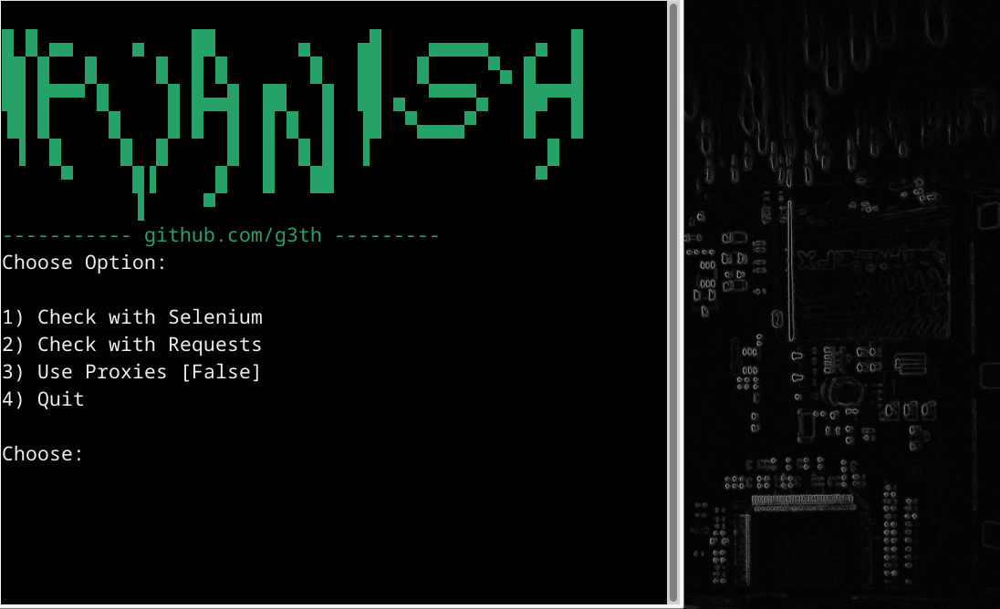

# IPvanish Account Checker
## Account Checker Using Selenium Webdriver and Requests



Load up any combo-lists, and check whether accounts for the IPVanish VPN service are valid or not.


Included is a small module which will download chromedriver for your current chrome version, and place it in the ```chromedriver``` folder present in the program's main directory.


Either use Selenium, or just send a POST request to IPVanish's api endpoint.


Selecting option 3 will allow you to enter your ```IpVanish SOCKS 5 Proxy``` credentials, and rotate through their own proxies in order to check accounts. Make sure your credentials are valid. Ideally:

1) Check with Selenium first
2) Get some Proxy credentials
3) Pick option 3, and enter your Proxy credentials,
4) Check other accounts with requests to gain some speed. 


Combos are placed in a file named "ipvanish" (no extension) placed in the ```combos``` folder.


Valid accounts are stored in the ```valid``` folder.


NOTE: You can always get blocked due to too many requests/cancerous Cloudflare.
